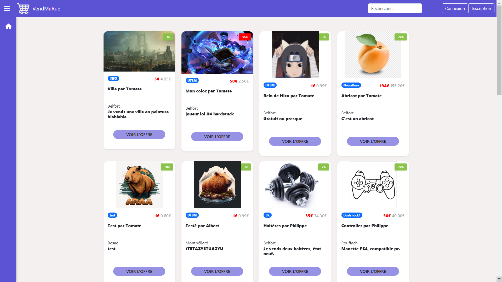
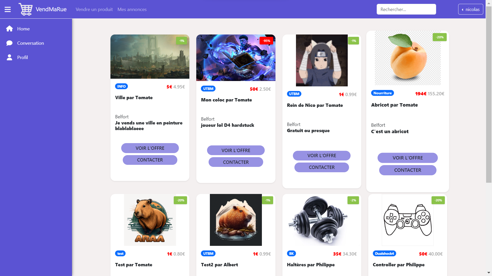
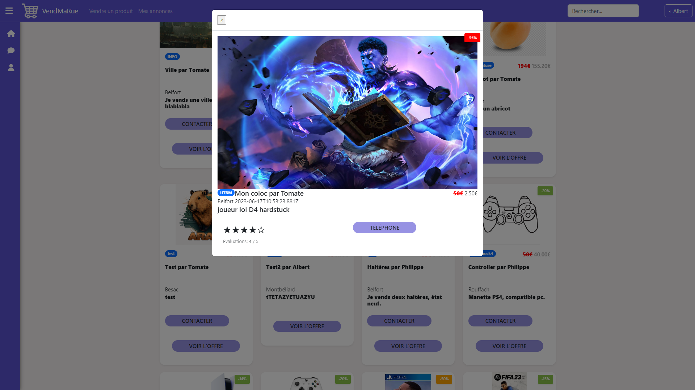
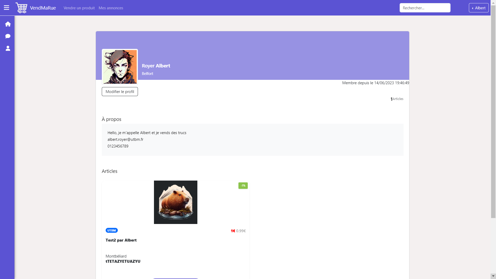
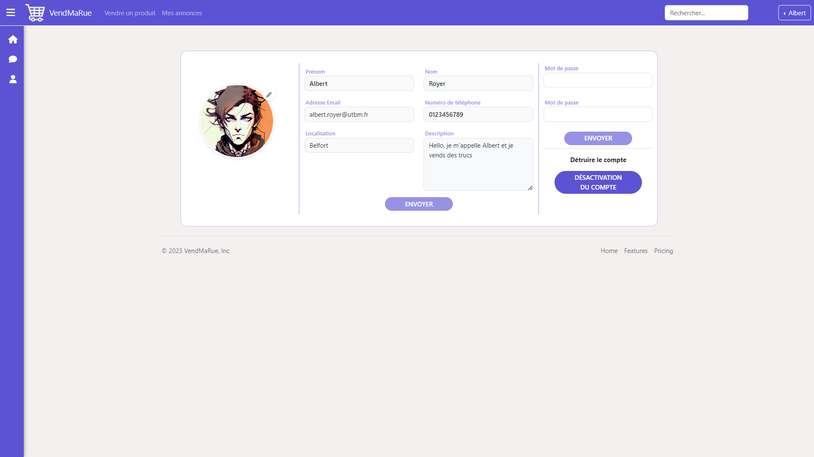

# WE4B-Project

## Informations

### Projet étudiant

- Université: [UTBM](http://www.utbm.fr/)
- UV: WE4B
- Semestre: P23

### Auteurs

- [Albert Royer](https://github.com/Rarynn)
- [Camille Tariel](https://github.com/cami010318)
- [Nicolas Marcelin](https://github.com/nic0c0)
- [Osman Gaygusuz](https://github.com/osmandaway)

### Sujet

Le projet de l’UV WE4B repose sur le développement d’un front-end sous Angular pour une application single page moderne .
C'est pourquoi nous avons décidé de créer un site web type marketplace : **VendMaRue**.

---
## Sommaire

- [WE4B-Project](#we4b-project)
  - [Informations](#informations)
    - [Projet étudiant](#projet-étudiant)
    - [Auteurs](#auteurs)
    - [Sujet](#sujet)
  - [Sommaire](#sommaire)
    - [Screenshots](#screenshots)
    - [Installation des dépendances :](#installation-des-dépendances-)
    - [Lancement du projet](#lancement-du-projet)
    - [Fonctionnalités](#fonctionnalités)
    - [Echantillon de test :](#echantillon-de-test-)
    - [Le site :](#le-site-)
      - [Components :](#components-)
      - [Services :](#services-)
      - [Classes :](#classes-)
      - [Autres :](#autres-)
      - [Style :](#style-)
    - [Conclusion :](#conclusion-)
      - [TODO](#todo)

### Screenshots








### Installation des dépendances :

- Gestion des mots de passe :

```bash
npm install bcryptjs
npm install --save-dev @types/bcryptjs
npm install crypto-browserify stream-browserify assert stream-http https-browserify os-browserify
npm install crypto-browserify
```

- Gestion des images :

```bash
 npm install firebase
 npm install firebase @angular/fire
```

---
### Lancement du projet

- lancement du serveur json:

à éxecuter dans le dossier src/

```bash
 json-server --watch db.json
```

- lancement du serveur angular:

```bash
 ng serve
```


### Fonctionnalités

- Système de connexion / déconnexion / inscription/ suppression.
- Implémentation d'une fonction de recherche pour permettre aux utilisateurs de trouver du contenu spécifique :
  - Recherche d'un produit
  - Recherche d'un utilisateur
  - Recherche par localisation
  - Recherche par marque
- Système de notation par étoiles : seuls les utilisateurs connectés peuvent noter.
- Système de profil/paramètres :
- Chargement des produits en AJAX.
- Systeme de publication de produits / modification / effacement.
- Mots de passe cryptés.
- Système de messagerie pour contacter un vendeur et répondre client

### Echantillon de test :


| Email| Nom| mdp      |
| -------- | --- | ---------- |
|albert.royer@utbm.fr | Royer Albert  | root  |
| t@t.t | Trombonne Tomate  | t|
| z@z.z| Zebre Zelda  | z|
|a@a.a|Abricot Alain|a|
|lemuscle@muscle.com| Jean Philippe |test|
|fifa@fifa.com| Lionel messi |test|
|anime@anime.com| Kanguy Yone |test|
|tel@tel.tel| Telephone Telegraphe|test|
|poule@poule.com|Lons Mickael|test|
|nicolas.marcelin@utbm.fr|marcelin nicolas|root|

### Le site :

#### Components :

- annonces-filtres : pour afficher les résultats de recherche
- card : une annonce
- cards : toutes les annonces
- chat :
- confirmation-dialog : pop up de confirmation
- connexion : page de connexion
- create-card : formulaire de création d'annonce
- footer : footer
- inscription : page d'inscription
- mes-annonces : toutes les annonces de l'utilisateur
- new-header : header
- new-sidebar : sidebar
- popup-card : modal d'une annonce
- profil : page de profil
- redirect : page de redirection
- search : barre de recherche
- settings : page de paramètres

#### Services :

- card : pour les annonces
- evaluation : pour les notations sur les annonces
- file-upload : pour les images
- search : pour la recherche

#### Classes :

- Card : pour les annonces
- Evaluation : pour les notations sur les annonces
- User : pour les utilisateurs
- Chat : pour les conversations
- Message : pour les messages des conversations

#### Autres :

- Environements : pour le lien firebase

#### Style :

Bootstrap & CSS

### Conclusion :

Nous avons développé l'application "VendMaRue", une plateforme de type marketplace. Notre objectif était de créer un site web moderne en utilisant Angular comme framework front-end.

Nous avons réussi à mettre en place les principales fonctionnalités attendues, telles que le système de connexion, d'inscription et de déconnexion des utilisateurs, ainsi que la possibilité de rechercher des produits, des utilisateurs et des localisations spécifiques. Enfin, nous avons également mis en place un système de notation par étoiles, réservé aux utilisateurs connectés, et un système de profil et de paramètres pour les utilisateurs. Nous avons un système de conversation pour mettre en contact acheteurs et vendeurs.

L'un des aspects clés de notre projet était le chargement des produits en utilisant AJAX, ce qui permet une expérience utilisateur fluide et réactive. Nous avons également implémenté un système de publication, de modification et de suppression des annonces.

Nous avons pris en compte la sécurité des mots de passe en utilisant la bibliothèque "bcryptjs" pour le hachage des mots de passe. De plus, nous avons utilisé Firebase pour gérer le téléchargement et le stockage des images associées aux annonces.

En conclusion, notre projet "VendMaRue" est une application fonctionnelle qui répond aux exigences d'une marketplace moderne. Nous avons réussi à développer les fonctionnalités clés et à offrir une expérience utilisateur agréable. Nous avons également pris en compte la sécurité des utilisateurs en utilisant des méthodes de cryptage des mots de passe. Nous sommes fiers du travail accompli et des connaissances acquises tout au long de ce projet.

#### TODO

- [Patch warning](https://stackoverflow.com/questions/67572355/webpack-5-angular-polyfill-for-node-js-crypto-js)
- système de follow
